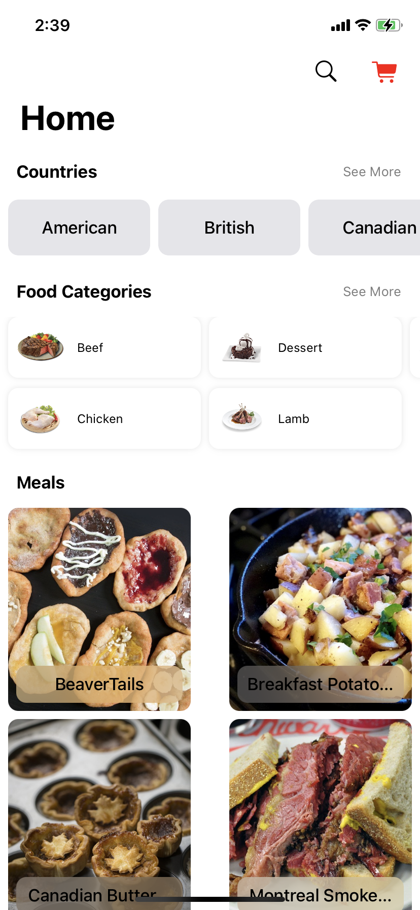
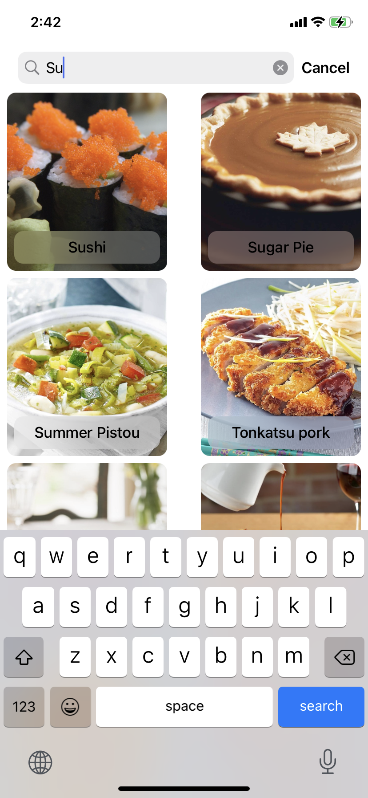
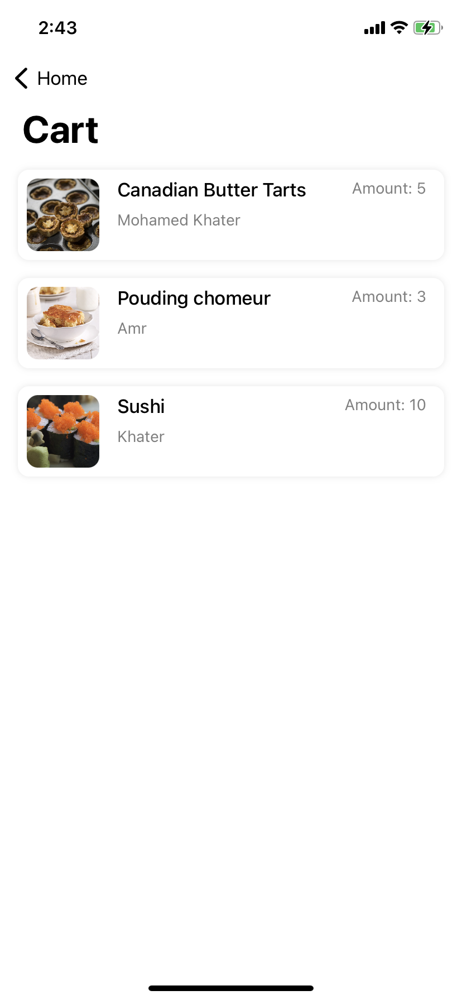
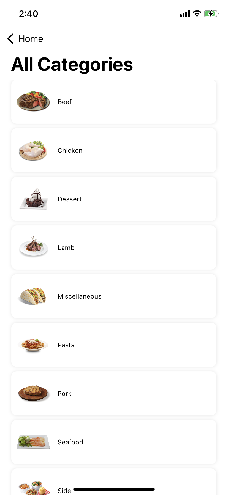

# Foody

<!-- Project Settings -->

 

<!-- Main Screenshot -->

    
    
    
    
    

<!-- Project bref -->
An app that shows all meals from all around the world.

<!-- ____________________________________________________________________________ -->
## Table of Contents
 - [Features](#features)
 - [Technologies](#technologies)
 - [Dependencies](#dependencies)
 - [Demo Video](#demo-video)
 - [Screenshot](#screenshot)

<!-- ____________________________________________________________________________ -->
## Features
- Countries
    - Meals in the Country
- Meals Categories
    - Meals in Category
- Search for Meal
- Meal Details
    - Category
    - Tags
    - Ingredients and measure
    - Instructions video
- Add to Cart with the amount

<!-- ____________________________________________________________________________ -->
## Technologies
- [The Meal API](https://www.themealdb.com/api.php)
- Combine
- Core Data
- User Defaults
- Delegation
- WebKit

<!-- ____________________________________________________________________________ -->
## Dependencies
- [SDWebImage](https://github.com/SDWebImage/SDWebImage)
- [SkeletonView](https://github.com/Juanpe/SkeletonView)

<!-- ____________________________________________________________________________ -->
## Demo Video

> Click on the image to show the demo video

<!-- Video Link -->
<a href="https://youtu.be/TO8MNaZs5zE">
    <!-- Video Image -->
    
</a>

<!-- ____________________________________________________________________________ -->
## Screenshot

_ |  | _
---------- | ----------- | ----------
 |  | 
 |  | 
 |  | 
